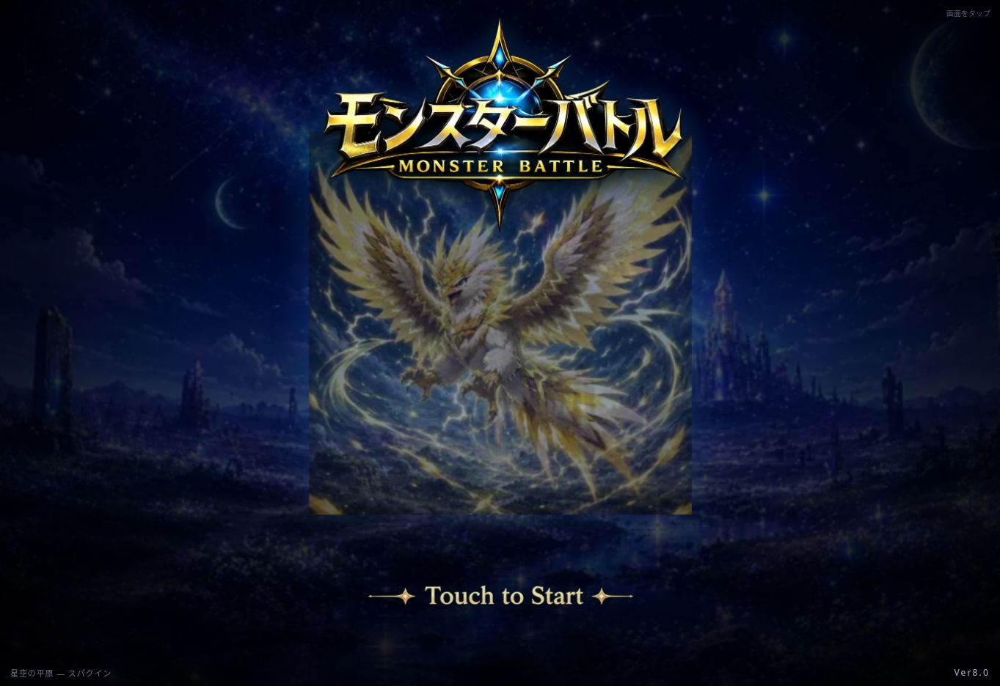

# 初めて遊ぶ人の体験・ゲーム全体点検（2026-09-08 JST）

## 要点と判定の限界

**収集→編成→戦闘→育成の循環を支える機能は揃っている。一方、「手に入れた仲間を使う」「育成を続ける」「次の探索へ戻る」の接続に具体的な改善余地があった。5点を修正し、自動検証した。**

これは**コード・自動テスト中心の点検結果**であり、スマートフォンでの全体プレイ合格報告ではない。公開版は起動画面の表示と読み込み対象を確認した。独立したコピーでの操作を試みたが、このセッションのCloud BrowserはローカルHTTPへの接続、および共有ファイルURLの閲覧を拒否した。制限を迂回せず、実セーブを用いた代替プレイも行っていない。新規開始から主要機能までのブラウザ通し、修正後の画面、Android/Chromebookは未確認。

楽しさ・初見理解度・テンポ・継続意欲を「良好」と断定できる証拠は得られていない。大幅なバランス・物語・排出率・新機能は変更しない。mainへのマージ・本番公開は行わず、実画面検証が残るDraft PRとして提出する。

## 対象と重複確認

- リポジトリ: https://github.com/kankidoi2-byte/monster-rpg-ver8
- 公開URL: https://kankidoi2-byte.github.io/monster-rpg-ver8/
- 基準main: `4ad50548f3dd9e5803cb7f2308c8df2e2d3c6f1a`。GitHub APIで開始時と提出準備時に再確認。
- default branch: `main`。両確認時ともopen PR検索結果は0件（Draftを除外する条件なし）。
- 現行 `AGENTS.md` と `tools/game-production-orchestrator/risk-approval-contract.json` を確認。
- 既存ローカルコピーを別ディレクトリへ複製し、GitHub APIのmain SHAと一致することを確認して作業ブランチを作成。元コピーは編集していない。
- 作業ブランチ: `fix/mobile-first-play-audit-20260908`。
- 公開ページのtitleは「モンスターバトル Ver8.0」。DOM上のscript参照は基準mainの版に対応していた。ただし全配信ファイルのハッシュ・PagesデプロイSHAは未照合。起動成功だけから最新版の完全配信を断定しない。
- 過去のAndroid合格記録を今回の修正や世界地図全体の合格に流用していない。

## 証拠の区分

- **A：ブラウザで観測** — 公開タイトル画面のみ。画面サイズ1363×936、開始ボタン・ロゴ・Ver8.0を確認。ゲーム開始・セーブ管理・リセット・インポート操作なし。ページ自身の通常初期化は実行される。
- **B1：自動再現済み** — 実装関数をNode VMと簡易DOM/メモリ内セーブで実行。ブラウザ・実機の操作再現とは区別する。
- **B2：コードに基づく懸念・矛盾** — 表示文と実際の処理・既存の回帰検証を照合。実際にプレイヤーが迷った観測はない。
- **C：改善仮説** — 楽しさや理解度への影響は人間の初見テストで検証が必要。

## 優先問題と今回の修正

優先度P1は主要な行動導線の誤り、P2は反復操作・説明の明確な問題、P3は検討候補。今回、進行不能をブラウザで確認した問題はない。

| ID / 優先度 | 画面・再現手順 | 根拠・分類 | プレイヤーへの影響 | 対応 |
|---|---|---|---|---|
| F01 / P1 | キャラクターガチャ→1回または10回→結果の「編成する」 | B1。`rollCharacterGacha`が`show('party')`を出力。`party`は育成一覧、実際の編成は`partySet`。生成HTMLのハンドラを実行して遷移先を検証 | 獲得直後の「使ってみたい」が、そのボタンでは達成できない | `partySet`へ変更。自動編成や現在のパーティー変更はしない |
| F02 / P2 | 仲間一覧→個体の「育成・個体情報」を開く→経験値アイテム使用→同じ個体を続けて育成 | B1。`useExpItemOnInstance`→`renderParty`が`open`なしのdetailsで再構築。修正前の関数で回帰テストが失敗することを確認 | アイテムごとに詳細を開き直す必要。ロック切替でも同じ問題 | 開いていた個体UIDとアイテム一覧の開閉を表示更新時に保持。同種の別個体と混同しない。セーブ項目追加なし |
| F03 / P2 | 世界地図から探索→勝利・敗北・撤退→結果の次ボタン | B1/B2。`worldMapExploration`の戦闘でも結果ボタンが「次の討伐依頼へ」「依頼を選び直す」。実際は`afterBattleNext`→`showBattleChoices`→世界地図の選択状態へ | 次に開く画面を誤解しやすい | 世界地図経由は「探索先へ戻る」。序章の依頼形式の再試行文言は維持。通常/序章×3結果を自動検証 |
| F04 / P2 | 遠征→空き枠あり→派遣できる控えがいない（全員編成中／一部遠征中／全員遠征中） | B2。元の空表示が一律「パーティーから外してください」。遠征中判定とは一致しない | 戦闘用の最後の1体を外す誘導、全員遠征中なのに編成解除を探す迷い | 状態別の案内へ変更。複数の戦闘用仲間がいれば編成へのリンク、1体なら維持を案内、全員遠征中なら受取/途中帰還を案内。時間経過で進まないことも明記。4状態を自動検証 |
| F05 / P2 | 黄金郷のガイド「地図と自然発見は別の入口」を読む→ほかで2戦 | B2。`tutorial.js`に「挑戦するまで保持」。`WORLD_EVENT_BATTLE_LIMITS.golden_land`は2で、他戦闘の結果で期限消費 | 後回しにして入口が消えると説明を信用できなくなる | 「地図は消費しないが、ほかで2戦すると閉じる。閉じている間は進まない」と現行ルールに合わせて修正。期限そのものは変更しない |

これらは自動検証またはコード照合の結果であり、「実機で迷いを再現した5件」と数えない。

## 5観点の総評

### 1. 初回プレイ体験

`js/story.js`の序章は6話構成（目覚め、救援、支度、技、錬成、遠征）。`js/tutorial.js`は初戦に敵味方とHP→行動者→通常攻撃→技→自由戦闘の操作説明を配置し、初契約はエルナ救援と結び付いている。説明対象への誘導と章の区切り、再開処理があり、構造としての土台は良い。

第3話は編成・図鑑・育成・技・進化・依頼報酬と複数の画面を学ぶ。説明量や移動が負担かはC。会話や世界観を勝手に削らず、初見プレイヤーが「次に何を押すか」「何のためか」を言えるかで判断する。

初育成では「育成画面を見る」と「自分で強化して差を実感する」を区別すべき。現時点で後者の達成率を測っていない。

### 2. ゲーム全体のつながり

| 要素 | 実装で確認した役割・接続 | 残る評価 |
|---|---|---|
| 戦闘・世界地図 | 地点/難易度→戦闘→EXP・コイン・素材→再探索。特殊入口の期限あり | 難易度の理解、再挑戦の実際の手数は未確認 |
| 契約 | 勝利後の仲間獲得。序章に初契約の体験がある | 成功・失敗の満足度、契約書不足の頻度は未計測 |
| 育成・技・進化 | 経験値アイテム、技編集、レベル進化、合成・特殊進化 | F02修正。覚えたことが次戦で役に立つ実感は人間評価 |
| ココロリンク | 控えからの強化。低レアほど高い倍率の設定があり、低レアを持つ理由になり得る | 「高レアに置き換えれば常に強い」と誤解しないかをテストしたい |
| 錬成 | 素材・コインから新個体を生む。序章に入門体験がある | 費用・失敗・候補の理解と、素材の入手経路を追えるか |
| ガチャ | アイテム・技・キャラクターを同一ハブで選べる。キャラクターは現状3基本形態 | F01修正。図鑑の登場予定枠と現在の排出対象は区別されているため、枠があるだけで排出漏れとは判定しない |
| 遠征 | 控えを派遣し、自分の戦闘勝利で報酬と経験値を得る。1/3/5勝、完了数で枠拡張 | F04修正。派遣と通常パーティーの取り合いが楽しいかは未評価 |
| ストーリー | 6話の段階進行、話ごとの状態と再開 | 終了後に何を目標にするかは弱く感じられる可能性（C） |
| Rank・図鑑 | 複数の活動をEXP・報酬・収集記録へ集約 | 未受取報酬への気づき、次の収集先を自分で決められるか |

### 3. 操作性・テンポ

F01/F02/F03は規則変更なしで改善可能な摩擦だった。育成の結果通知は依然として`alert`であり、連続育成の確認操作は残る。まとめて使用、通知への置換は誤消費防止や結果確認の設計が必要なのでCとして保留。

`show()`には一般的な画面遷移時のスクロール整理がない一方、図鑑やチュートリアルは個別のスクロール処理を持つ。長い画面を移動したときの見失いはB2の懸念。ブラウザ検証なしで全画面スクロール処理を変えると案内を壊す可能性があるため変更しない。

### 4. スマホでの見やすさ

世界地図には600px/360px以下のレイアウト規則と広い出発ボタン、ホームには44px以上の編成ボタン規則がある。これはCSSの存在確認であり、320/360/390/430pxでの合格証拠ではない。

ホームの補助文字には8〜11px指定がある。お気に入り中心の1画面構成の意図を尊重しつつ、低視力・屋外・Androidの文字拡大で読めるかはB2の懸念。幅変更・文字拡大・実タップの検証が必要。

公開タイトルでは開始案内を視認できた。キャラクター画像の四角い背景境界も見えるが、素材の見せ方の好みを含むためP3/C。透明素材へ勝手に置き換えない。

### 5. 続けたくなる仕組み

中期目標として図鑑、進化、技、錬成、Rank、遠征枠がある。序章終了後のホームは「序章クリア／ストーリー／物語を見る」の案内となるため、次の具体的な行動がプレイヤー任せになりやすい（B2/C）。一方、進行中の話数表示と遠征の報酬表示は既にあり、再開案内が皆無という評価はしない。

キャラクター/技ガチャは1回100、10回900コイン。これだけで高すぎる/安すぎるとは判定できない。草原報酬の既存方針や特殊入口の期限も現行どおりとし、所要時間・自然な獲得量・勝率の観測なしに経済バランスを変更しない。

## 10分・30分・1時間の評価計画（実績ではない）

| 観測時点 | 初見プレイヤーに確認すること | 記録する値 |
|---|---|---|
| 10分 | ゲームの目的と次の行動を説明できるか。初戦・初契約へどこまで進んだか | 現在話/ステップ、迷い、戻った回数、説明待ち |
| 30分 | 新しい仲間を自分で編成し、強化や技変更の理由を説明できるか | 自分で選んだ強化、次戦での使用、コイン/契約書 |
| 60分 | 次に欲しい仲間・進化・攻略先を1つ挙げられるか。再開したい理由はあるか | 選んだ目標、達成感/負担、資源不足、離脱したくなった場面 |

時点ごとの到達内容は期待を押し付ける合格条件ではない。今回、10/30/60分の通常プレイは行っていない。VMで与えたアイテム/コイン/仲間から実際の育成速度や所要時間は算出しない。

## 検証結果と再実行

- 基準mainの `npm run check`：成功。
- F02の修正前実装に新規テストを適用：期待どおり失敗。EXP使用後のopen UIDが`['second']`ではなく空となる。
- `npm run check:first-play-clarity`：成功。実際のEXP使用/ロック関数、同種2個体の識別、閉じた詳細、消えた個体、世界地図/依頼の勝利・敗北・撤退、遠征4状態。
- `npm run check:character-gacha`：成功。生成結果の「編成する」ハンドラが`partySet`へ進むことを追加確認。既存テストは獲得・重複UID・コイン不足・メモリ内ストレージでの保存/再読込を含む。
- 修正後の `npm run check`：全体とpostcheckを含めて成功（提出時に最終ログを同梱）。世界地図・序章・契約・ココロリンク・進化関連・遠征・ガチャ・セーブ互換性・お知らせ・UI契約など既存ゲートを実行。
- `git diff --check`：成功。
- UI契約テストの成功はDOMの実レイアウトや人間の使いやすさを保証しない。ログに既存Android記録への言及があっても、新たに実機検証した意味ではない。
- 実セーブ・ブラウザのlocalStorageをfixtureとして読み取ったり、リセット/上書きインポートしたりしていない。自動テストは合成データとメモリ内ストレージ。

最終チェックログ: [20260908-validation.log](20260908-validation.log)。

## 判断が必要な改善案

| 案 | おすすめ | 判断理由・確認方法 |
|---|---|---|
| 序章後の次の目標 | 既存ホームの文章・導線を使い「次に育てる1体／未登録の1体」など1件だけ提案する案を検討 | お気に入り中心の画面を維持し、日課や新報酬を増やさず迷いを減らせる可能性。初見テスト後に表示内容を決める |
| 初回説明の削減 | 第3話の説明をすぐ削らず、迷った箇所を記録してから任意説明への移動を検討 | 物語の意図と必須操作を守る。説明を減らして理解も落ちる可能性がある |
| 初期経済・排出率 | 今は現状維持 | 通常プレイの資源推移と失敗頻度が未計測。ガチャ価格・契約書・草原報酬を一括で調整すると原因が分からなくなる |
| 連続育成 | 今回の詳細保持を先に試し、必要なら数量指定や結果通知を別設計 | 誤消費や進化が途中に挟まる場合の仕様が必要 |

## 次に行う価値が高い作業（最大3件）

1. **分離したブラウザ環境でこのPRの実画面検証**：360/390/430px、新規序章、F01〜F05、保存/再読込、通常戦の勝利/敗北/撤退。Androidでタップと文字拡大も確認する。
2. **初見1名の60分テスト**：10/30/60分で上表を記録し、「迷い」と「面白さ」を分ける。助言を最小限にし、終了後の再開も1回試す。
3. **序章終了後の目標案を1件に絞る**：観測結果から育成・収集・攻略のどれが最も自然かを選び、既存ホーム内で提案する。バランス変更は資源ログを得てから。

この報告と修正はレビュー用。公開可否・全体プレイ合格は未判定。
