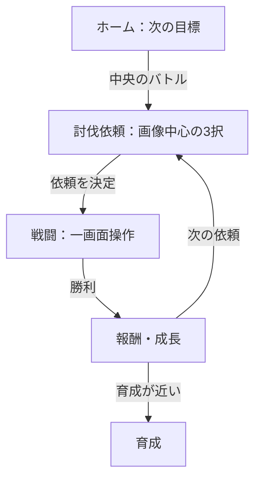

# UI再設計：採用ワイヤーフレーム

## 採用方針

スマートフォンの縦画面を基準とし、ホーム、討伐依頼選択、戦闘を一続きの短い循環として設計する。

## ホーム

- 上部には契約者ランクと主要通貨だけを置く。
- 最も大きな領域を「おすすめ討伐・冒険へ」に使う。
- 現在のパーティーは3体の画像を横並びで見せる。
- 次のレベルアップ、進化、遠征帰還など、すぐ行動できる情報だけを表示する。
- 画面下部に5項目の常設ナビゲーションを置き、中央のバトルを強調する。

## 討伐依頼選択

- 現行の3択を維持する。
- マップ画像、敵画像、難易度、主報酬を先に見せる。
- 倍率、特殊条件、説明文は`details`で段階表示する。
- 初心者向けに、現在のパーティーへ適した依頼を「おすすめ」として1件示す。

## 戦闘

- 画面上部に敵、下部に味方を置き、モンスター画像を最大化する。
- 敵味方のHPと必要最小限の状態を、画像の近くへ重ねて表示する。
- 技と副コマンドは画面下部へ固定し、スクロールをなくす。
- 通常戦では1画面、三つ巴では敵を上部左右へ配置する。
- 技の詳しい威力や効果は詳細操作で確認し、通常時は技名と役割だけを見せる。

## 常設ナビゲーション

- ホーム
- モンスター
- バトル（中央強調）
- 育成
- メニュー

## プロトタイプ

`prototypes/ui-redesign/`に、ホームから討伐依頼を選び、戦闘で技を使うところまで操作できる確認用プロトタイプを置く。このプロトタイプはゲーム本体のセーブとロジックへ接続しない。
